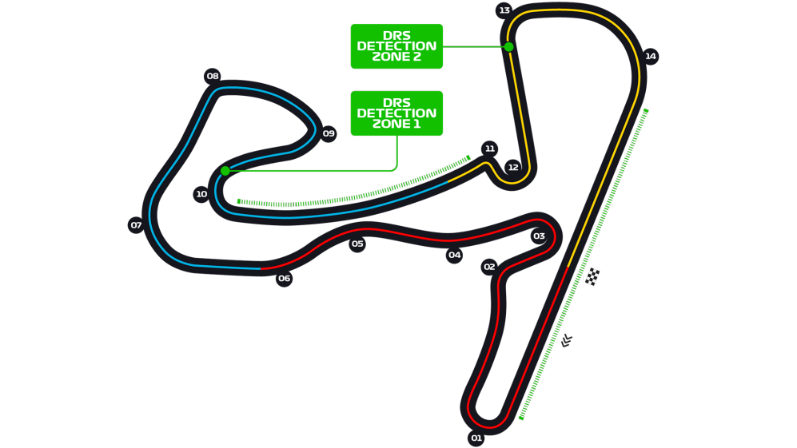

# Data Visualizations - Assignment 1

### _The Era of Simulation & Visualization_ ✨

Welcome to the assignment of the Data Visualization 2022 course. The assignment of this year is composed from a
collaboration between the UTwente ESportsLab and the Creative Technology Data Visualization Course. Hence, the theme of
this years assignment is ESports with its focus on racing simulation. With this assignment, you will be participating in
a research currently being conducted by the ESportsLab. The results of your visualisations will be used for evaluati  This document will provide you all the necessary information to
proceed with this assignment.

Let's first start by getting the variables that correlate to your group number.
 Please enter your group number --> <input type="number" id="teamid" name="teamid"/> <input type="submit" value="Request Group">

## The Contents

1. Team
2. Background information
    1. The background of this collaboration
    2. The ESportsLab Research goal
3. The Assignment
    1. The Assignment
    2. The Datasets
    3. The assignment criteria
    4. Deliverables
4. Grading & Passing Criteria
5. Potential continuation of the assignment

## Team

| Name | Function | Contact Details |
| ----- | ----- | ----- |
| [Antoine Moghaddar] | Assignment Lead | a.a.moghaddar@student.utwente.nl | 
| [Andreas Kamilaris] | Course Lead | | 
| [Guido Bruinsma] | Spokesperson ESportsLab |  | 
| [Jannick Siderus] | Student Assistant|  | 

## Background Information

[todo] include information on ESports and Research

## The Assignment
For the assignment, several datasets are recorded. These recordings contain laps that have been driven by various drivers from all classifications.
As the level of expertise differs per driver, the datasets vary a lot, making analysis on these datasets more interesting.
The aim of these assignments is to identify differences in driver performance, to pinpoint the elements that require improvement and to obtain insights into specific driver performances. 

The assignment is subdivided into 6 sections. The aim for the first section of the assignment is to provide you with a 
basic understanding of the composition of the dataset. Here you are asked to perform simple visualizations based on the 
variables that you have been provided with. The second part of the assignment is to gain deeper knowledge on the  variables, combine and compute variables and to put variables in a time sequence.
Continuing forward, the third assignment is on the comparison of the variables among different drivers over a specified time sequence. 

> We want to encourage you to play around with different visualisation types to enhance and brighten up the story you want to convey with your visualizations.

### Basic assignment criteria

- For the duration of this entire assignment, you are allowed to work in pairs,
- Every assignment section should be analysed and documented.  We want to have a clear reasoning why you chose the visualisation type and what the story is you want to tell with your visualisation,
- All axis should be labelled with a axis-name, a unit and a correct and logical tick,

> This assignment is an assignment that you may do individually or in pairs. While it is not mandatory to work in pairs, we do urge you to work in pairs as otherwise the assigment might be a bit too much to handle.

***

### The Assignment Sections

#### Assignment Section 1

Within this first section, we lay the basic foundation of the assignment. The goal is to get you familiarized with the 
available elements and let you play with simple visualisations. This first assignment is, in its core, equal for all 
students. However, every student duo has received two different variables which should yield different types of 
visualisations. The dataset that can be used for this assignment is [TODO: insert dataset].  Within this assignment, the x-axis is the performance element
The thirs 
Given the variables [V1] and [V2], visualize and analyse the following:
> 1) Plot the two variables independently into two different visualizations.  What is your analysis per variable?   
> 2) Plot the two variables dependently into one visualisation.  How do these variables correlate to each other?

***

#### Assignment Section 2

The second section of the assignment is about digging deeper into the driver performances. This is where we want to see 
the correlations and the key differences between (and within) laps and track segments. You have been provided with various datasets that 
each correlate to one specific driver and his/her performances. We want to display the variables [V1] and [V2] against the 
same variables from a differrent lap and/or segment. For your group, the datasets that you can use is [D1]. 

> The analysis that we will do in this assignment will be based on both _track segments_ and _laps_ driven. 
> Circuit Zandvoort has a total of 3 Segments divided as follows
> 

> **TODO Check the assignment on correctness** 
> 1. Lap Focused analysis
>     1. Over the duration of a lap, what analysis can you deduce from [V1]? Show this within a visualization and explain what the potential causes for this behaviour are.
>     2. Over the duration of a lap, what analysis can you deduce from [V2]? Show this within a visualization and explain what the potential causes for this behaviour are.
>     3. Define the qualitatively "best lap". from this lap, analyse the causes and effects of [V1] and [V2].
> 2. Segment Focused Analysis
>     1. Over the duration of a segment, what analysis can you deduce from [V1]? Show this within a visualization and explain what the potential causes for this behaviour are.
>     2. Over the duration of a segment, what analysis can you deduce from [V2]? Show this within a visualization and explain what the potential causes for this behaviour are.
>     3. Has the driver performed statistically better or worse compared to the segment averages? analyse the causes and effects of [V1] and [V2]. Deduce from this analysis the possible effects that can explain this behaviour

***

##### Assignment Section 3
Within this assignment we want to obtain a new perspective from comparing multiple drivers to see how drivers behave
 and whether there can be defined a _standardized_ behaviour for certain events during a session. We want to analyse the
  differences among different drivers to gain insights in how driver behave in certain situations and whether this behaviour
 is the most efficient way to behave. For simplicity, we have recorded a set of different datasets containing data from
 multiple drivers with different skill levels. Every dataset contains a set of approximately 18 recorded laps

***

##### Assignment Section 4
In this section, we want to exploit the visualisations and analysis that we have made before and produce an insightful
 dashboard for the end-user. The aim of this assignment is to teach you have to tell a story with research that you have
 conducted

***

## Grading & Passing Criteria

The grading criteria is defined as follows

| Section # | Minimal Requirements | # Points to obtain | 
| --------- | ----------- | --------- |
| Section 1 | [x] Three "logical" data visualisations using two different variables, 2) A brief analysis on the output of each visualisation. | 10 Points |
| Section 2 | | 20 Points |
| Section 3 | | 30 Points |
| Section 4 | | 10 Points |
| Section 5 | | 10 Points |
| Section 6 | | 20 Points |

# Potential Continuation of the assignment

[//]: # (sources and references - These are not visible)

[Esports]: <https://www.utwente.nl/nieuws/2019/10/251292/esportslab-op-universiteit-twente>

[Andreas Kamilaris]: <>

[Antoine Moghaddar]: <https://www.linkedin.com/in/antoine-moghaddar-b9129180/>

[Guido Bruinsma]: <https://www.linkedin.com/in/guidobruinsma/>

[Jannick Siderus]: <https://www.linkedin.com/in/jannicksiderius/>

[V1]: <>

[V2]: <>

